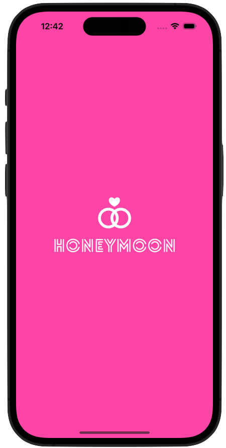
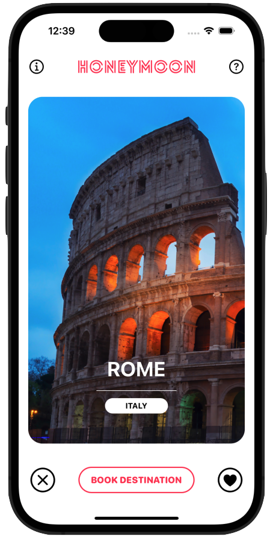
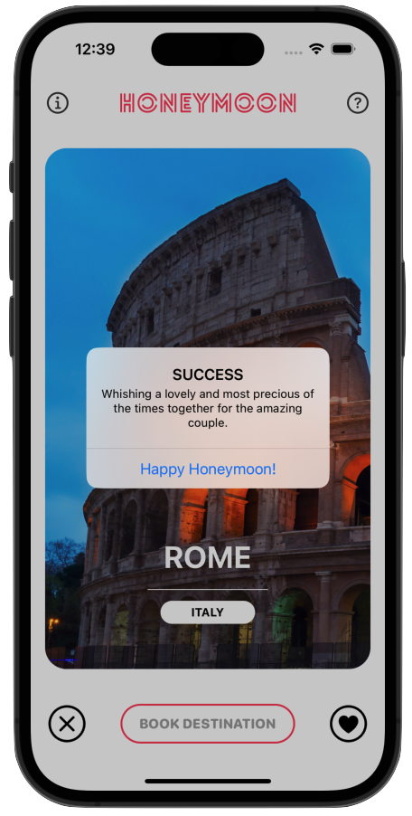
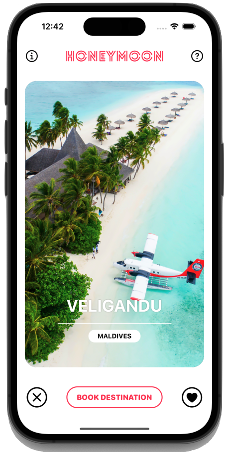
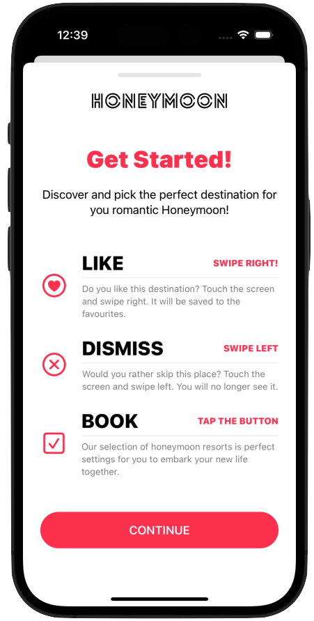
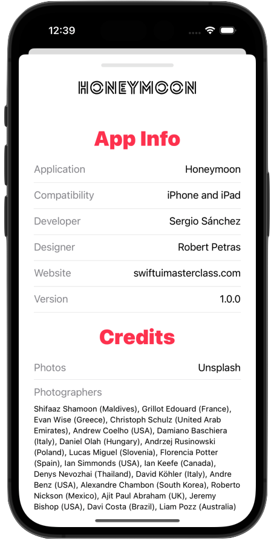

# SwiftUI Honeymoon 🌙❤️

Welcome to **SwiftUI Honeymoon**, an advanced iOS and iPadOS application that showcases the beauty and power of SwiftUI. This project is part of the [SwiftUI Masterclass](https://swiftuimasterclass.com) by [Robert Petras](https://robertpetras.com). 

  
  
  
  

This project offers a comprehensive learning experience in SwiftUI, including:

### 🎯 Objectives:

1️⃣ **Advanced App Design**: Learn to design eye-catching applications for iOS and iPadOS.  
2️⃣ **Launch Screens & App Icons**: Master the creation of custom launch screens and app icons.  
3️⃣ **Reusable UI Components**: Build and reuse UI components to enhance development efficiency.  
4️⃣ **Guide and Info Views**: Create beautiful guide and information views for your app.  
5️⃣ **File Organization**: Properly organize your project files for scalability and maintainability.  

### 🃏 Core Topics:

6️⃣ **Deck of Cards**: Design and implement an interactive deck of cards.  
7️⃣ **Long Press Gestures**: Master long press gestures for improved interactivity.  
8️⃣ **Custom Transitions**: Create stunning custom transitions between views.  
9️⃣ **Drag Gestures**: Enhance user experience with advanced drag gestures.  
🔟 **Light & Dark Modes**: Support both Light and Dark Modes seamlessly using SwiftUI.  

### ✨ New Features:

- **Complex Drag Gestures** 🕹️: Implement advanced dragging interactions.  
- **Modern UI** 🎨: Design with modern user interface principles.  
- **Vector Assets and Sounds** 🎶: Integrate vector graphics and sounds into your app.  
- **Animations** 🔄: Bring your app to life with smooth SwiftUI animations.  

## 📂 Project Overview

This project is structured to demonstrate how to:

- Build reusable components for your UI.  
- Apply animations and gestures for a premium user experience.  
- Organize your SwiftUI project like a pro.  

## 🛠️ Requirements

- Xcode 14 or later.  
- iOS 16 or later.  
- Swift 5.7 or later.  

## 📸 Screenshots

## 📚 Resources

- Author: [Robert Petras](https://twitter.com/robertpetras)  
- Course: [SwiftUI Masterclass](https://swiftuimasterclass.com)  
